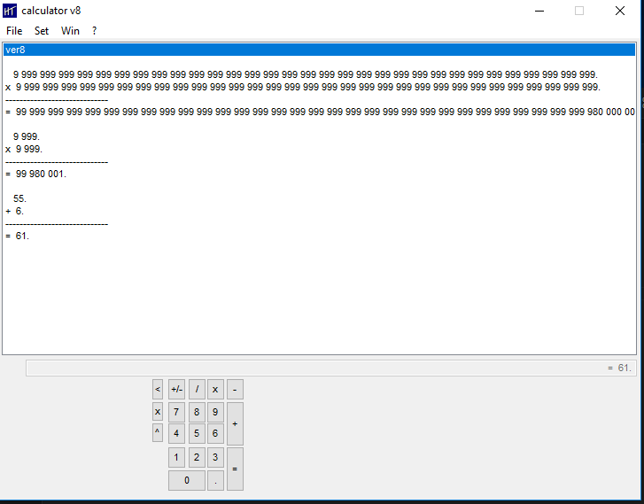

# Googole Calculator
##### version 8
 

    

## Compile 

Text in vs terminal $ ./build_config.bat or CTRL+SHIFT+B

## Launch:

PS You should make shure that masm32 exists in folder ".\asm_modules\masm32"

 
